Mekanbul Backend
🔗 Demo: [https://mekanbul-backend-six.vercel.app/](https://mekanbul-backend-six.vercel.app/)
🔗 Demo: [https://mekanbul-frontend-drab.vercel.app/](https://mekanbul-frontend-drab.vercel.app/)

Bu repo mekanbul-backend uygulamasının basit Node.js + Express + Mongoose backend'idir.

Kısa Açıklama:

API, mekan (venue) verilerini yönetir: listeleme, ekleme, görüntüleme, güncelleme ve silme.
MongoDB Cloud kullanır. Bağlantı bilgisi: (bak: app_api/models/db.js).
Kurulum

cd /path/to/backend
npm install
Uygulamayı çalıştırma

npm start
API Endpoints

Tüm mekanları listele: GET /api/venues
Yeni mekan ekle: POST /api/venues
Mekan detayını getir: GET /api/venues/:venueid
Mekanı güncelle: PUT /api/venues/:venueid
Mekanı sil: DELETE /api/venues/:venueid
Yorum ekle (mekana): POST /api/venues/:venueid/comments
Yorum getir: GET /api/venues/:venueid/comments/:commentid
Yorum güncelle: PUT /api/venues/:venueid/comments/:commentid
Yorum sil: DELETE /api/venues/:venueid/comments/:commentid
User ekleme : POST /api/users/register
User login: POST /api/users/login
Postman Test Sonucu Aşağıda Postman ile alınmış test sonuçlarının ekran görüntüsü bulunmaktadır:

Postman koleksiyonu proje klasörüne eklenmiştir: 
/Guyde Badinga.postman_collection.json

Aşağıda, tüm API’lerin başarılı şekilde çalıştığını gösteren Postman test ekran görüntüleri bulunmaktadır.
### Mekan Listeleme
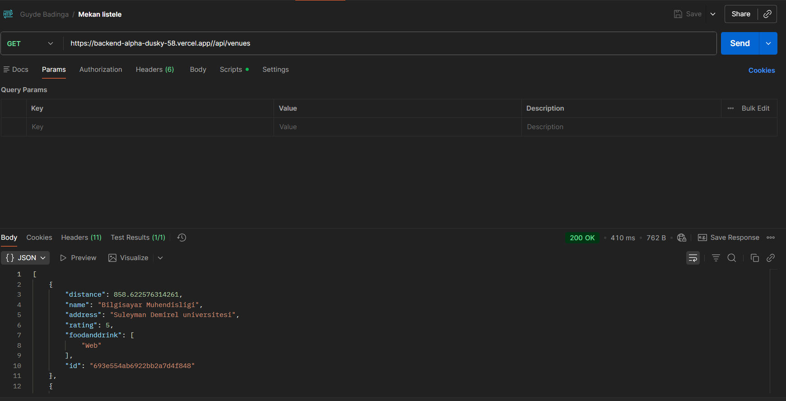
### Mekan Ekleme
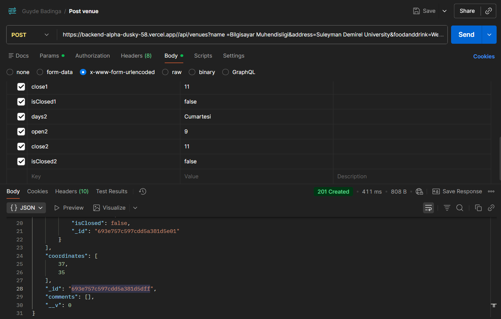
### Mekan Göster
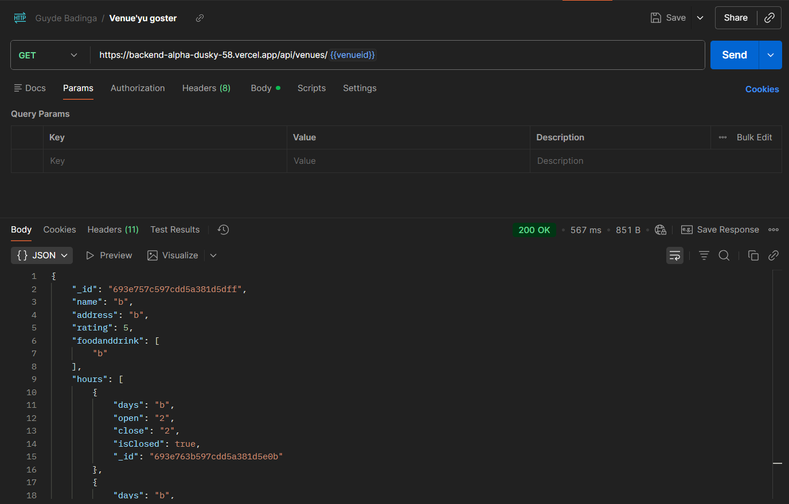
### Mekan Güncelle
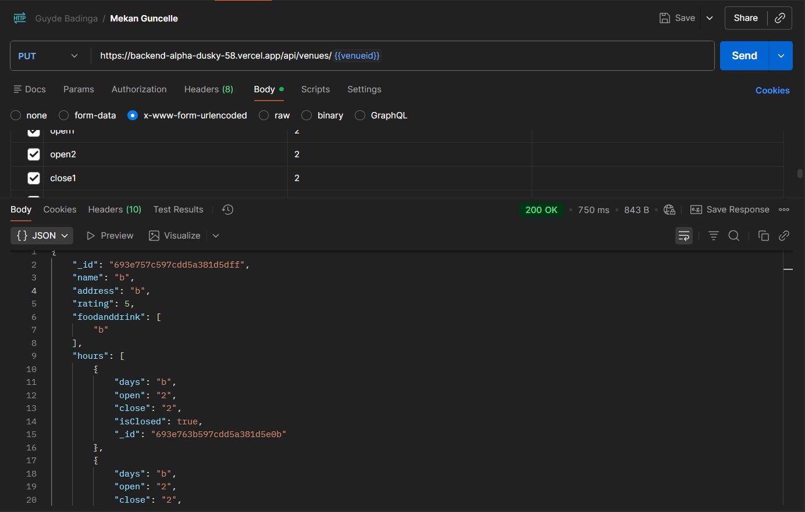
### Mekan Silme
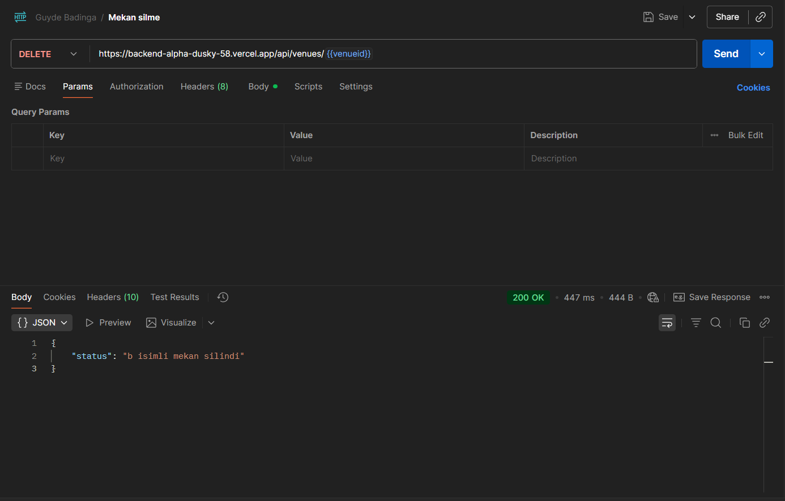
### Yorum Ekle
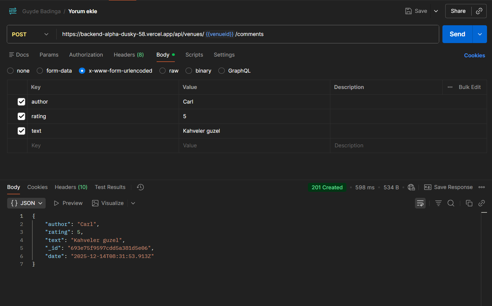
### Yorum Göster
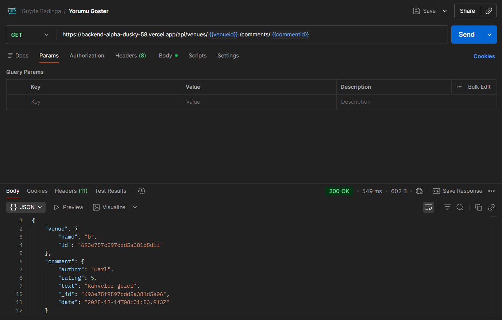
### Yorum Güncelle
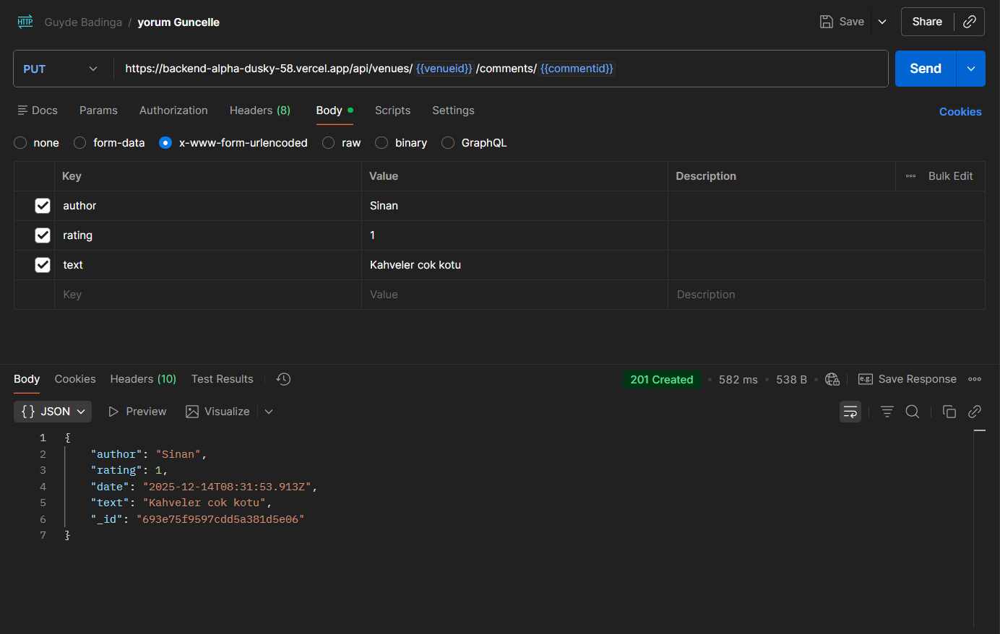
### Yorum Silme
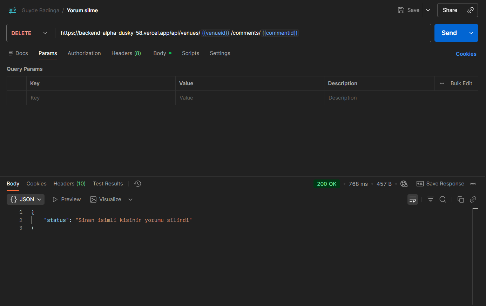
### User Register
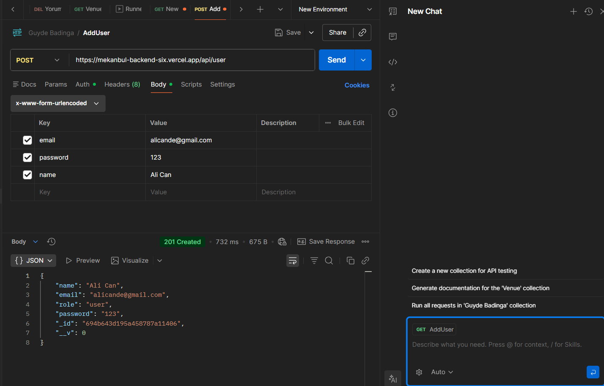  
### User Login
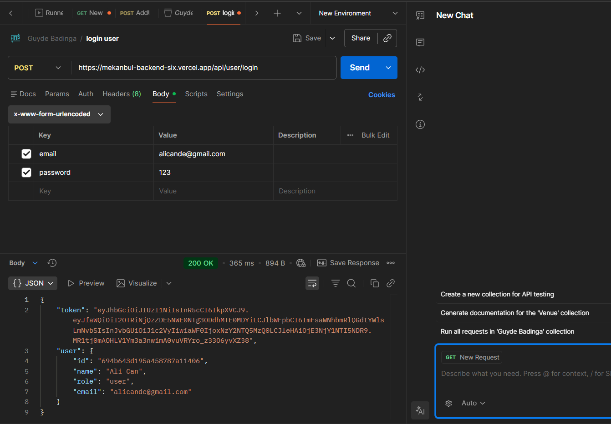

Mekanbul React Front-End
Mekanbul, kullanıcıların çevrelerindeki mekanları keşfetmesini ve yorum yapmasını sağlayan bir React tabanlı Single Page Application (SPA) projesidir.

Canlı Linkler
Vercel: https://mekanbul-frontend-drab.vercel.app/
Localhost: http://localhost:5173/
🚀 Kurulum ve Çalıştırma
# Bağımlılıkları yükle
npm install

=
=

# Geliştirme sunucusunu başlat
npm run dev
Kullanılan Teknolojiler
React - UI kütüphanesi
React Router - Sayfa yönlendirme
Redux Toolkit - State yönetimi
Axios - HTTP istekleri
Bootstrap - CSS framework
Vite - Build tool
Bileşenler (Components)
Sayfa Bileşenleri
Home - Ana sayfa, mekan listesi ve arama özelliği
VenueDetail - Mekan detay sayfası (puan, saatler, harita, yorumlar)
About - Hakkında sayfası
PageNotFound - 404 sayfa bulunamadı sayfası
AddComment - Yorum ekleme sayfası
AddVenue - Yeni mekan ekleme sayfası
UpdateVenue - Mevcut mekanı güncelleme sayfası
AdminDashBoard - Yönetici paneli (mekan yönetimi)

Layout Bileşenleri
Template - Tüm sayfalar için ortak şablon (Navbar ve Footer içerir)
NavBar - Üst navigasyon menüsü
Header - Sayfa başlığı ve slogan
Footer - Alt bilgi (telif hakkı)
Mekan Bileşenleri
Venue - Tek bir mekan kartı (ad, puan, adres, mesafe)
VenueAdmin - Yönetici için mekan kartı (düzenle, sil)
VenueList - Mekan listesi (birden fazla Venue bileşenini gösterir)
VenueDetail - Mekan detay sayfası   
Yardımcı Bileşenler
Rating - Yıldız puanlama bileşeni (1-5 arası)
Comment - Tek bir yorum kartı
CommentList - Yorum listesi
FoodAndDrinkList - Yiyecek/içecek etiketleri listesi
HourList - Çalışma saatleri listesi
InputWithLabel - Etiketli input bileşeni (otomatik odaklanma özelliği ile)
Yardımcı Servisler (Services)
http-common.jsx - Axios instance yapılandırması (baseURL, headers)
Utils.jsx - Yardımcı fonksiyonlar:
formatDate() - Tarihi Türkçe formatta gösterir (örn: "15 Ocak 2024")
formatDistance() - Mesafeyi km veya m cinsinden gösterir
VenueDataService.jsx - API servis sınıfı:
nearbyVenues(lat, long) - Yakındaki mekanları getirir
getVenue(id) - Belirli bir mekanı getirir
Redux State Yönetimi
store.jsx - Redux store yapılandırması
reducer.jsx - State yönetimi için reducer:
Yorum ekleme state'leri
Veri çekme (fetch) state'leri
Hata ve yükleme durumları
Proje Yapısı
frontend/
└── src/
    ├── components/                 # React bileşenleri
    │   ├── About.jsx
    │   ├── AddComment.jsx
    │   ├── AddVenue.jsx
    │   ├── AdminDashBoard.jsx
    │   ├── Comment.jsx
    │   ├── CommentList.jsx
    │   ├── FoodAndDrinkList.jsx
    │   ├── Footer.jsx
    │   ├── Header.jsx
    │   ├── Home.jsx
    │   ├── HourList.jsx
    │   ├── InputWithLabel.jsx
    │   ├── Login.jsx
    │   ├── Modal.jsx
    │   ├── NavBar.jsx
    │   ├── PageNotFound.jsx
    │   ├── Rating.jsx
    │   ├── Register.jsx
    │   ├── Template.jsx
    │   ├── UpdateVenue.jsx
    │   ├── Venue.jsx
    │   ├── VenueAdmin.jsx
    │   ├── VenueDetail.jsx
    │   └── VenueList.jsx
    │
    ├── redux/                      # Redux store ve reducer
    │   ├── reducer.jsx
    │   └── store.jsx
    │
    ├── services/                   # API servisleri
    │   ├── http-common.jsx
    │   ├── Utils.jsx
    │   └── VenueDataService.jsx
    │
    ├── data/                       # Statik veya yardımcı veriler
    ├── fonts/                      # Font dosyaları
    │
    ├── App.css
    └── main.jsx                    # Uygulama giriş noktası

Ayar Dosyaları ve Klasörler
vercel.json - Vercel deployment ayarları (SPA routing için)
vite.config.js - Vite build tool yapılandırması
public/javascripts/ - Bootstrap JavaScript dosyaları
public/favicon.ico - Website ikonu

Özellikler
Mevcut Özellikler
Mekan arama ve filtreleme
Mekan detay sayfası (harita, saatler, yorumlar)
Yorum ekleme ve görüntüleme
Yıldız puanlama sistemi
Responsive tasarım (Bootstrap)
Redux ile state yönetimi
React Router ile sayfa yönlendirme
Google Maps entegrasyonu
Geliştirici
Guyde Freny Badinga - 2025
